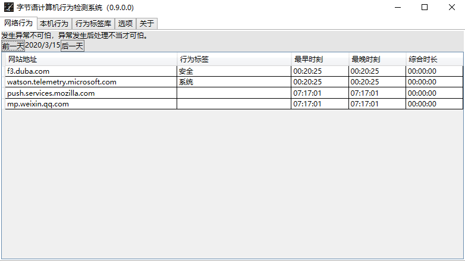
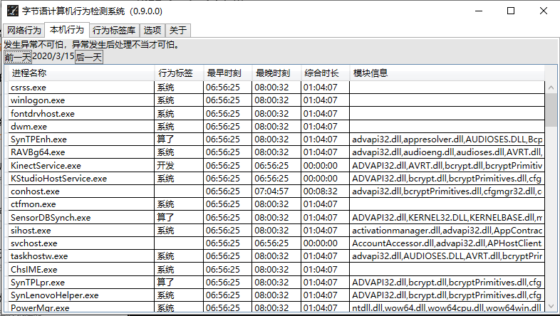

# “字节语计算机行为检测系统”(ByteLang Behave Monitor Kit)数据包

[English Version](./README.en.md)

## “字节语计算机行为检测系统”安装包

1. 中国大陆 <https://gitee.com/molihub/bmk.data/raw/master/Bmk/Bmk.zip>
2. 国际镜像 <https://github.com/molihub/bmk.data/blob/master/Bmk/Bmk.zip?raw=true>

## 安装使用

数据包由“字节语计算机行为检测系统”下载使用，用户可以在系统中设置自动下载。

## 系统功能简介

* 《字节语计算机行为检测系统》用于检测计算机上的网站访问行为和进程行为，并进行识别分类。
* 系统可以发现计算机上通过浏览器、后台应用进行的全部网页访问，可以发现用户使用的部分（不定时检测，不保证全部）程序，并对其标注为诸如：系统、新闻、购物、游戏、办公和广告等18类不同类别。

## 系统要求

* Windows 10 测试通过。技术上支持一下系统，未测试。
  * Windows >= 8.1
  * Windows Vista
  * Windows Server >= 2003

## 界面截图

### 网络行为

### 进程行为

