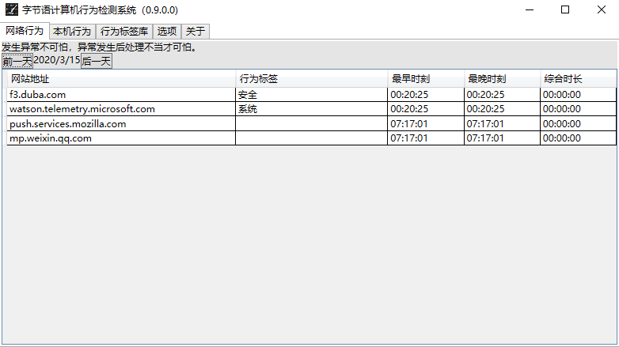

# Data of ByteLang Behave Monitor Kit

[简体中文版](./README.cn.md "Chinese")

## Bmk Application Installer

1. China(中国大陆) <https://gitee.com/molihub/bmk.data/raw/master/Bmk/Bmk.zip>
2. Global Mirror(国际镜像) <https://github.com/molihub/bmk.data/blob/master/Bmk/Bmk.zip?raw=true>

## Install

Downloaded by BMK automatically.

## Snapshot

### 网络行为

### 进程行为

